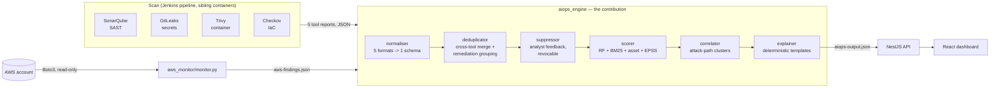
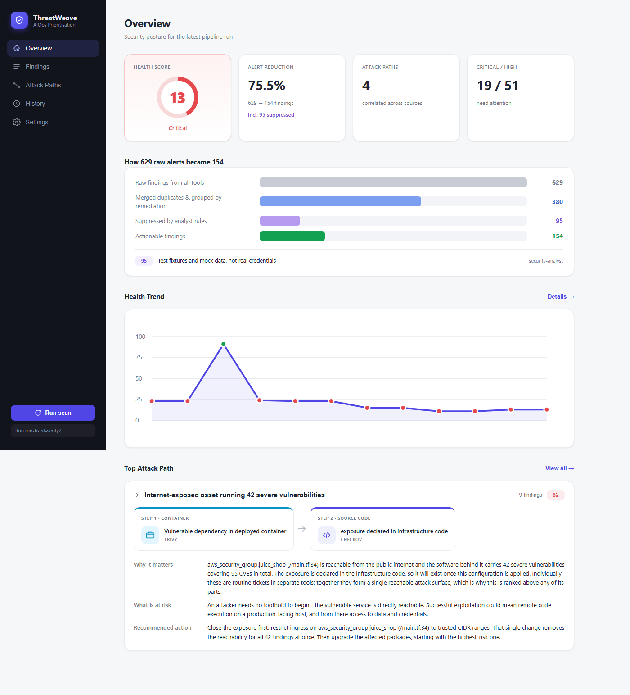
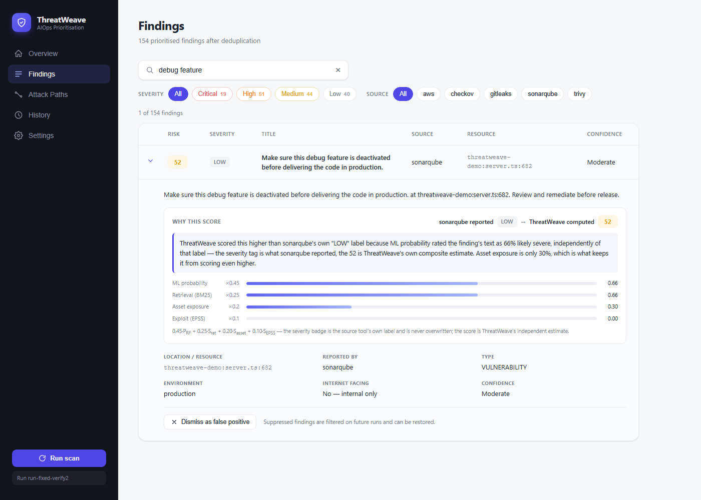
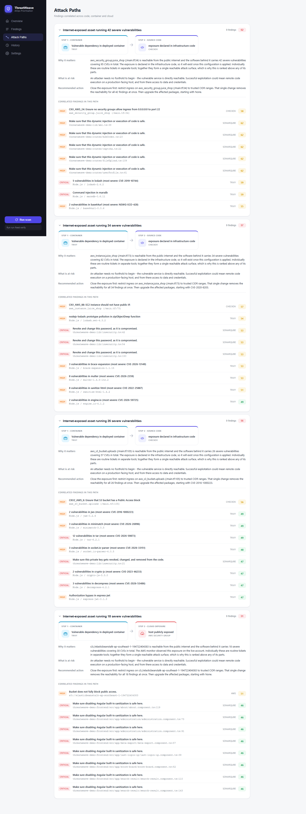

# ThreatWeave

AIOps-driven security alert prioritisation for SMEs on AWS.
Implementation (Part 2) of the Final Year Project.

Four scanners (SonarQube, Trivy, GitLeaks, Checkov) and a live AWS monitor feed
a Python engine that deduplicates, scores with a trained model, correlates
findings **across** code, container and cloud into attack paths, and explains
each one in plain English. Results are served by a NestJS API and shown on a
React dashboard.

**The contribution:** individually, a vulnerable dependency and an open
security group are two routine tickets in two different tools. On the same
asset they are one exploitable route. The correlator finds those routes.

---

## Architecture



Five independent sources feed one Python pipeline. Every stage degrades
gracefully — a missing scanner report, an untrained model, or no AWS
credentials each fall back to a documented heuristic rather than breaking
the run, and a warning is printed loudly rather than silently changing the
numbers.

---

## Results on real data

SonarQube, Trivy, GitLeaks, Checkov and the AWS monitor run against OWASP Juice
Shop and a live AWS account:

```
629  raw findings from 5 sources     (SAST 75, container 107, secrets 417,
                                      IaC 25, cloud 5)
249  after cross-tool merge + remediation grouping     (-380 duplicates)
154  after analyst suppression       (-95, test fixtures in the demo's own
                                      test suite, not real credentials)
     = 75.5% reduction, 4 attack paths, health score 13/100
```

The 4 attack paths are 4 *distinct* internet-facing exposure points found in
this account — an open security group, an EC2 instance with a public IP, and
two exposed S3 buckets (one declared in Terraform, one observed live) — each
clustered with the severe vulnerabilities reachable through it, not one
undifferentiated cluster for the whole run.

Validation across three graded scenarios (`validation/results/VALIDATION.md`):

| Scenario | Health | Raw | Actionable | Reduction | Attack paths |
|---|---|---|---|---|---|
| Baseline (remediated) | 97/100 | 12 | 6 | 50.0% | 0 |
| Moderate (partial) | 70/100 | 47 | 23 | 51.1% | 0 |
| Critical (unremediated) | 11/100 | 538 | 147 | 72.7% | 1 |

---

## Demonstration

**Overview** — health score, noise-reduction funnel, health trend across
runs, and the top attack path, all on one page:



**Findings** — every finding ranked by ThreatWeave's own composite risk
score, expandable to see *why* that score differs from the source tool's own
severity label (the "Why this score" panel breaks down the four weighted
signals that produced it):



**Attack Paths** — the correlator's output: each card names the exposure
point, the correlated findings behind it, and a plain-English why/what/action
explanation, generated by deterministic templates rather than an LLM:



---

## Installation

Docker (with Compose v2) is the only real prerequisite — everything else
(Jenkins, the scanners, SonarQube) runs inside containers. Two ways to get
running:

### Option 1 — one-line installer (recommended)

```bash
curl -fsSL https://raw.githubusercontent.com/saeedamer2333/threatweave/main/scripts/install.sh | bash
```

`scripts/install.sh` checks Docker is installed (offers to install it via
`get.docker.com` if not), clones the repo, writes a `.env` with the correct
host path already filled in, fetches the demo scan target, and brings the
whole stack up — ending with a summary of the dashboard/Jenkins/API URLs.
Nothing is installed on the host besides Docker itself, and only with your
say-so.

Non-interactive install (e.g. scripted/CI): set `THREATWEAVE_TARGET` to an
absolute path to scan your own project instead of the bundled demo, and
`THREATWEAVE_DIR`/`THREATWEAVE_BRANCH` to control where/what gets cloned.

> While this repo is private, the installer can't fetch it anonymously —
> either flip the repo public first, or use Option 2 with your own
> authenticated `git clone`.

### Option 2 — manual (Docker Compose)

```bash
git clone https://github.com/saeedamer2333/threatweave.git
cd threatweave/implementation

cp .env.example .env                    # set HOST_WORKSPACE to this directory's host path
scripts/fetch-demo-target.sh            # clones OWASP Juice Shop for GitLeaks/SonarQube to scan
docker compose up -d                    # Jenkins + API + dashboard
```

`scripts/fetch-demo-target.sh` is only needed for the bundled demo target —
skip it if `TARGET_PATH` in `.env` already points at your own project (see
[Scanning your own project](#scanning-your-own-project) below).

| Service | URL | Notes |
|---|---|---|
| Dashboard | http://localhost:3000 | |
| Jenkins | http://localhost:8080 | admin / admin |
| API | http://localhost:4000/api | Set `API_PORT` in `.env` if 4000 is taken |

Optional profiles:

```bash
docker compose --profile sast up -d    # SonarQube for SAST (needs ~3GB RAM)
docker compose --profile demo up -d    # Juice Shop as a local scan target
```

### Option 3 — plain `docker run`, split images (no compose, no clone)

All three images are published to Docker Hub (`saeedalameri/threatweave-{api,dashboard,jenkins}`),
and `docker-compose.yml` pulls them via `image:` rather than building from
source. The API and dashboard images are genuinely standalone — the Python
engine is baked into the API image rather than relying on a bind mount, and
the dashboard's nginx config resolves its API target at container start, not
at build time:

```bash
docker run -d -p 4000:4000 saeedalameri/threatweave-api:latest
docker run -d -p 3000:80   saeedalameri/threatweave-dashboard:latest
```

That's it — no `.env`, no clone, no volumes. The API starts with the bundled
sample findings (`aiops_engine/sample_inputs/`) already baked in, so
`POST /api/scan` produces a real result immediately. Point the dashboard at a
different API host with `-e API_TARGET=host:port` (default `api:4000`, which
only resolves inside a compose network — that's the one thing this mode
doesn't give you for free).

Persist real results across restarts with a volume:

```bash
docker run -d -p 4000:4000 -v threatweave-findings:/app/findings saeedalameri/threatweave-api:latest
```

**Jenkins is the one piece that can't fully work this way.** The pipeline
launches scanners as sibling containers via the mounted Docker socket, and
those containers' volume mounts are resolved by the *host* daemon using real
host paths (see [`HOST_WORKSPACE` — why it exists](#host_workspace--why-it-exists)
below) — so running the Jenkins image standalone starts Jenkins itself fine,
but the `threatweave-pipeline` job needs an actual checkout on the host to
scan anything:

```bash
docker run -d -p 8080:8080 -p 50000:50000 \
  -v /var/run/docker.sock:/var/run/docker.sock \
  -e HOST_WORKSPACE=/absolute/path/to/threatweave/implementation \
  -v /absolute/path/to/threatweave/implementation:/workspace \
  saeedalameri/threatweave-jenkins:latest
```

### Option 4 — all-in-one (single container)

Jenkins, the API and the dashboard as three processes in one container,
published as `saeedalameri/threatweave:latest` and built from the root
[`Dockerfile`](Dockerfile). One command, fully configured through
environment variables — the pattern GitLab CE's all-in-one image uses:

```bash
docker run -d --name threatweave \
  -p 3000:80 -p 4000:4000 -p 8080:8080 -p 50000:50000 \
  -v /var/run/docker.sock:/var/run/docker.sock \
  -v threatweave-jenkins-home:/var/jenkins_home \
  -v threatweave-findings:/workspace/findings \
  saeedalameri/threatweave:latest
```

Dashboard on `:3000`, API directly on `:4000`, Jenkins on `:8080` — all
reachable immediately, and `POST /api/scan` (or clicking "Run scan" in the
dashboard) works out of the box against the baked-in sample findings, same
as the split API image. Both volumes are optional but recommended: without
them, Jenkins configuration and scan history reset on every container
recreation.

Everything below is a real environment variable this image reads — set
whichever apply with `-e NAME=value`:

| Variable | Default | Controls |
|---|---|---|
| `JENKINS_ADMIN_ID` | `admin` | Jenkins login username |
| `JENKINS_ADMIN_PASSWORD` | `admin` | Jenkins login password — **change this for anything but local use** |
| `SONAR_HOST_URL` | unset | SonarQube server for the SAST stage (run one separately and point here to enable it) |
| `SONAR_TOKEN` | unset | SonarQube analysis token, paired with the above |
| `PORT` | `4000` | Port the API process listens on inside the container |
| `PYTHON_BIN` | `python3` | Interpreter the API shells out to for the engine |
| `FINDINGS_DIR` / `AIOPS_OUTPUT` / `HISTORY_FILE` | under `/workspace/findings` | Where the engine reads/writes its output |
| `ENGINE_DIR` / `AWS_MONITOR` | under `/workspace` | Where the API finds the Python engine and AWS monitor scripts |

AWS credentials: mount `~/.aws` read-only (`-v ~/.aws:/root/.aws:ro`) rather
than setting keys as environment variables — the dashboard's Settings page
only ever *reports* what Boto3 already resolved, matching the project's "no
credentials in the product" posture described below.

**Scanning your own project in this mode** works the same way as the split
setup, just via bind mounts instead of `.env`: mount your project read-only
at `/target` (`-v /path/to/project:/target:ro`) and set `HOST_WORKSPACE` to
this image's own project checkout path on the host if you want the Jenkins
pipeline to actually run — see the trade-off note below and
[`HOST_WORKSPACE` — why it exists](#host_workspace--why-it-exists).

**The honest trade-off**, stated in the Dockerfile too: one container means
one thing to restart for any change, and Jenkins' need for host-level
Docker-socket access now sits in the same container as the web-facing
dashboard/API rather than isolated on its own. Prefer Option 2/3
(docker-compose or the split images) for independent restarts, smaller
per-service images, or that isolation; use this option when a single
`docker run` matters more than either.

### Running pieces directly

```bash
python aiops_engine/engine.py                    # engine on the sample inputs
python aws_monitor/monitor.py                    # cloud checks (--demo for no AWS)
python validation/run_validation.py              # the three validation scenarios
python aiops_engine/suppress_cli.py list         # manage suppression rules
```

### `HOST_WORKSPACE` — why it exists

The pipeline runs scanners as **sibling containers** through the mounted Docker
socket, so volume paths in those `docker run` commands are resolved by the host
daemon, not inside the Jenkins container. Passing `/workspace/...` there
silently mounts an empty directory: every scanner exits 0 and writes nothing.
`HOST_WORKSPACE` supplies the real host path, and `runScanner` verifies each
report exists with non-trivial size rather than trusting an exit code.

### Scanning your own project

The bundled Juice Shop is only the default target. To scan something else, set
`TARGET_PATH` in `.env` to its absolute host path — it is mounted read-only at
`/target` — then run the pipeline with parameters pointing there:

```bash
TARGET_PATH=/home/you/my-app          # in .env, then: docker compose up -d
```

| Parameter | Value |
|---|---|
| `SOURCE_DIR` | `/target` — scanned by GitLeaks and SonarQube |
| `TARGET_IMAGE` | your project's image, scanned by Trivy |
| `IAC_DIR` | `/target/infra` if the project has Terraform |
| `SONAR_PROJECT_KEY` | a key of your own, when SAST is enabled |

`toHostPath` translates both `/workspace` (ThreatWeave itself) and `/target`
(the project under test) to host paths, so scanners running as sibling
containers mount the real directories. The installer prompts for this path
when run interactively; `THREATWEAVE_TARGET` sets it non-interactively.

Two things are worth doing before trusting the numbers on a new project:
clear `aiops_engine/suppression_rules.json` to `{"rules": []}`, since the
shipped rule suppresses Juice Shop's test fixtures, and replace the
`Build & unit tests` stage with the project's real toolchain — it currently
just pulls a prebuilt image.

---

## Scoring

```
FinalRisk = 0.45·P_RF + 0.25·S_retrieval + 0.20·S_asset + 0.10·S_EPSS
```

| Component | Source |
|---|---|
| `P_RF` | Random Forest trained on 5,646 real NVD CVEs — accuracy 81%, ROC-AUC 0.902 |
| `S_retrieval` | BM25 over the same corpus, for findings with no CVE |
| `S_asset` | Deterministic exposure rules (internet-facing, production) |
| `S_EPSS` | Live exploitation probability from FIRST.org, cached daily |

`S_asset` has three bands. A finding that *is* the public exposure — an AWS
security group open to `0.0.0.0/0` — scores **1.0**. A finding reachable only
through another asset's exposure, such as a vulnerable package in a container
running behind that security group, scores **0.6**. One with no established
route scores **0.3**.

The middle band is what makes the term discriminate. Before it existed, every
container finding scored identically regardless of whether its host was
reachable, so the cross-source link the correlator reports never influenced the
ranking at all.

The model deliberately **excludes the CVSS score as a feature**. The label is
derived from CVSS, so using it would be circular; more importantly `P_RF` must
work for findings that have no CVSS at all, such as SAST results. It learns
from CWE identifiers and description text instead.

Explanations are template-based, never generated by an LLM: deterministic,
reproducible, and incapable of inventing a CVE or a fix.

---

## Layout

```
implementation/
├── Jenkinsfile              6-stage pipeline (scanners -> engine -> publish)
├── docker-compose.yml       Jenkins, API, dashboard (+ sast/demo profiles)
├── Dockerfile               all-in-one image (Option 4) - all 3 processes, 1 container
├── nginx-allinone.conf      dashboard nginx config for the all-in-one image
├── .env.example             HOST_WORKSPACE and Jenkins credentials
├── aiops_engine/            the contribution
│   ├── engine.py            orchestrates the seven stages
│   ├── normaliser.py        five tool formats -> one Finding schema
│   ├── deduplicator.py      cross-tool merge, then remediation grouping
│   ├── suppressor.py        analyst feedback loop, revocable and audited
│   ├── scorer.py            the weighted formula
│   ├── correlator.py        attack-path clusters
│   ├── explainer.py         deterministic templates
│   ├── health_score.py      saturating 0-100 score
│   ├── history_tracker.py   last 30 runs
│   └── ml/                  NVD download, RF training, prediction
├── aws_monitor/monitor.py   Boto3 checks, read-only, offline-safe
├── dashboard/
│   ├── backend/             NestJS API
│   └── frontend/            React + Vite
├── infra/main.tf            deliberately insecure demo target (scan fodder)
├── validation/              three scenarios and the evaluation report
├── scripts/
│   ├── install.sh                 curl | bash installer
│   └── fetch-demo-target.sh       clones Juice Shop for the demo (not vendored)
├── docs/screenshots/        images used in this README
└── findings/                engine output, history, settings
```

---

## Security posture

- **Read-only cloud access.** Every Boto3 call is a describe/list/get. The
  `SecurityAudit` managed policy is sufficient; the monitor cannot modify
  infrastructure even if compromised.
- **No credentials in the product.** Boto3 resolves an IAM role, then
  environment variables, then `~/.aws` (mounted read-only). The Settings page
  reports detected credentials rather than collecting them — a key-entry form
  on an unauthenticated dashboard would be exactly the exposure this tool
  flags.
- **Advisory only.** The system never remediates; it ranks and explains.

## Known limitations

- SonarQube SAST is gated on `SONAR_HOST_URL` and reports `skipped` when no
  server is configured. Start one with `--profile sast` and set the variable to
  include it; the results above were produced with all five sources.
- SAST findings are not grouped by rule. Five occurrences of the same
  SonarQube rule in five files are five findings, where five CVEs fixed by one
  package upgrade are grouped into one. Remediation grouping is currently
  dependency-shaped only.
- The validation scenarios measure health score, reduction and cluster count,
  none of which depend on `risk_score`. They therefore do not exercise the
  ranking itself - a scoring regression would still pass all three.
- No authentication on the dashboard (MVP scope).
- JSON files rather than a database.
- `infra/main.tf` is intentionally insecure and exists only to be scanned.
  Never apply it to a real account.

## License

[MIT](LICENSE)
